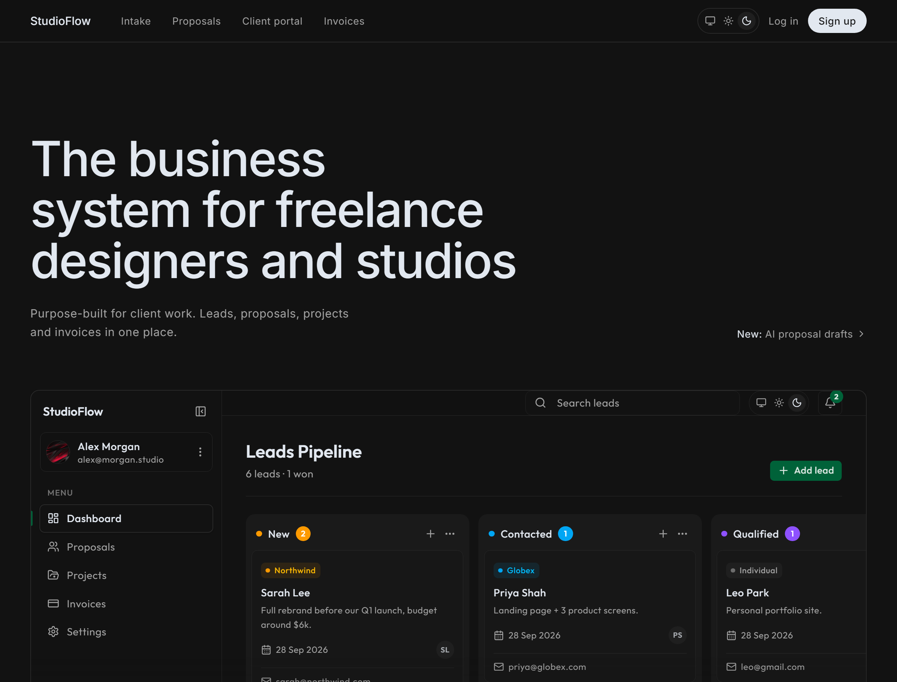

# StudioFlow

The all-in-one suite for freelance designers to win clients, manage projects, and get paid. No more scattered tools.

## Features

- **Deal Management (CRM)**
- **Proposal Builder**
- **Client Portal**
- **Invoicing & Finance**

## Creator

Built by [@abdullahmukadam](https://x.com/abd_mukadam)

## Code of Conduct

Please note that this project is released with a [Contributor Code of Conduct](CODE_OF_CONDUCT.md). By participating in this project you agree to abide by its terms.

## License

StudioFlow is source-available under the [Business Source License 1.1](LICENSE).

- **You can** read, modify and self-host it, including to run your own freelance or studio business with your own clients.
- **You can't** offer StudioFlow, or a modified version of it, to others as a hosted or SaaS product.
- **On 2030-10-07** the code converts to the [GNU AGPL v3.0 or later](https://www.gnu.org/licenses/agpl-3.0.html), a fully open-source license.

For other licensing arrangements, contact [@AbdullahMukadam](https://github.com/AbdullahMukadam).
